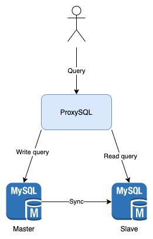

# MySQL Replication

Proxying write & read request to its intended master/slave MySQL instance using ProxySQL.

## How to use?

Run `docker-compose.yaml` and use the following credential to connect to ProxySQL:

- **port:** 16033
- **username:** root
- **password:** my-secret-pw